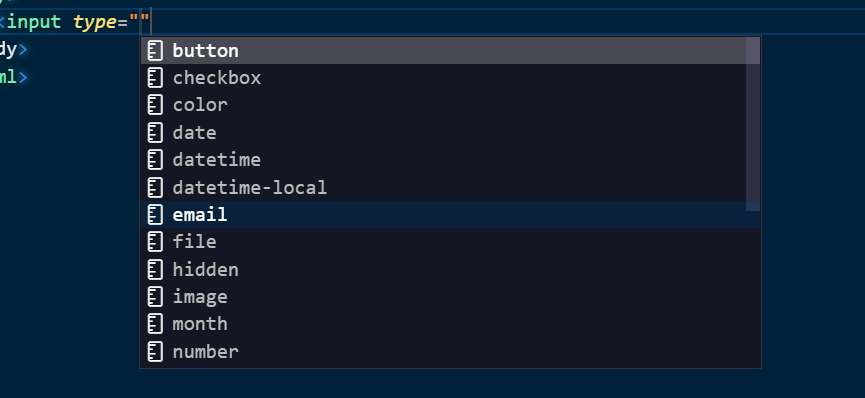

# HTML & CSS Fundamentals

**Basic Structure of HTML**

```
<!DOCTYPE html>
<html>
    <head>

    </head>
    <body>

    </body>
</html>
```

## HTML Attributes

**a and img**

- a is an anchor tag. We can use it to insert links by specifying the href attribute on the tag.
- Example:

```
<a href="https://www.google.com"> Google </a>
```

- Anchor is an inline element. It gets added right in front of other block elements such as p or h1 .
- img is also an inline element. Img does not need a closing tag.
- Example:

```

```

**Classes and ID's : Important html attributes**

- ID can only be added to one element. Generally we do not use ID's
- Classes can be added to multiple elements.

**Input Elements**

```
<input type="text" placeholder="Your Name">
```

- Input element does not require a closing tag
- Ex of input types
- 

## CSS

- We can include the CSS by including a style block within the head element
- We can select elements by specifying tags such as:
  Example: To style the body of an HTML file-

```
<head>
    <style>
        body {
            background-color : green;
        }
    </style>
</head>
```

**We can include our styles in a style.css file**

- Create file called style.css in same directory
- In the head element, add a tag for link with href="style.css" rel="stylesheet"
  Example:

```
<head>
    <link href="style.css" rel="stylesheet" />
</head>

# Content of style.css
body {
    background-color: green;
}
```

**Referencing Classes and ID's**

- For classes, include a .classname {} style block in our CSS sheet
  <br/>Ex:

```
style.css

.first {background-color: green;}
```

- For ID's include a #idname {} style block in our CSS Sheet

```
style.css

#uniqueid {background-color: green;}
```

## Box Model

**Box Model is one of the most important aspects of CSS**

- Most elements have some default margins, we can reset the margins to 0
- Include a global CSS selector \* and specify {margin:0; padding:0;}
- Specify the CSS reference by including the following:


<br/>

- **margin-bottom** ,**margin-top** are useful properties. Set to pixels (px)
- **text-align** : center aligns text to the center
- Margin adds space between the elements and other elements
- Padding adds space between the border of an element and its' contents

**Can also style multiple elements by seperating them by commas and including a common styling {} block.**
Ex:

```
input, button { border: 10px solid}
```
