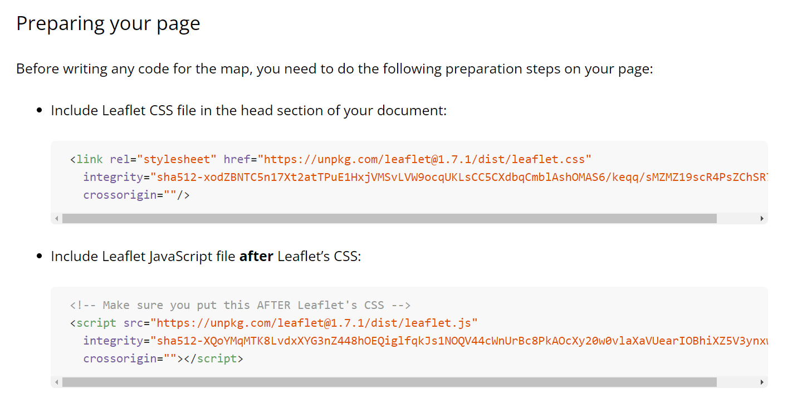

<link href="style.css" rel="stylesheet"; />

<h1 style="text-align:center;">OOP Project </h1>

<hr>

<h2> GeoLocation API </h2>

<ul>
<li> Geolocation is an inbuilt API in browsers. We can call it using <span>navigator.geolocation.method();</span></li>
</br>

```
// Using geolocation API

navigator.geolocation.getCurrentPosition(function(position) {
    console.log(position);
})

// Accessing current coordinates

navigator.geolocation.getCurrentPosition(function(position) {

    const latitude = position.coords.latitude;
    //better way of writing above code using destructuring
    const {latitude} = position.coords;

    const {longitude} = position.coords;

    console.log(latitude,longitude);

    // Generating google maps URL link using the coordinates

    const googleMapURL = `https://www.google.com/maps/@${latitude},${longitude}`
})

```

</ul>

</br>

<h2>Leaflet- open source JS Map Library</h2>

</br>

<ul>
<li>We can use the Leaflet map in our webpage by importing the line of code into our head</li>

</br>
</br>
<li>If we have multiple script tags defined in the HTML, the last script tag has access to all of the global variables from other script files that appear before it. </li>

```
HTML
<!DOCTYPE HTML>
<html>
    <head>
        <script defer src="first.js"> </script>
        <script defer src="other.js"> </script>
        <script defer src="main.js"> </script>
    </head>
</html>

If we have a variable const chin in other.js , we can use it in main.js.
But variables in other.js and main.js we cannot use in first.js
```

</br>

</ul>

</br>

<h2>Refactoring Code </h2>

</br>

<ul>

<li> If we assign values to variables within callback functions and we want to use the variables outside the callback function, we can simply declare the variable globally using <span>let</span> and then let the callback function handle value assignment to the global variable.  </li>

```
If we have the foll code:

const x = [1,5,10,15];

const sampleFn = (arr) => {

    const importantVal = arr[0];
}

// ImportantVal will only be accessible within the scope of the function

// Error
console.log(importantVal); results in an error

// Solution:

We can fix this by declaring the var globally and updating the function to remove the const declaration

const x = [...arr];

let importantVal;

const sampleFn = (arr) => {

    importantVal = arr[0];
}

```

<li> We can define our code using OOP by creating a Class and putting all of the work to be done inside functions in the class. Then we can create a new object from the class that will run the code. If we want methods within the class to be executed every time an object is created, we can include it within the constructor function. </br> <span>Note:</span>The constructor function is always executed whenever a new obj from a class is created.  </li>

```
If we have the following code block :

class App {
    constructor() {}

    _getPosition() {}

    _loadMap() {}

}

// If we wanted to execute the _loadMap() function as soon as a new object is created of the class we can put it within the constructor:

class App {
    constructor() {
        this._getPosition();
    }

    _getPosition() {}

    _loadMap() {}

}

```

</ul>

</br>

<h2>Local Storage </h2>

</br>

<ul>

<li> We can save data to local storage in the browser - it is a browser API</li>
<li><span>localStorage.setItem(key,value)</span> The key ands value must be strings
<div style="border:1px solid white;padding:15px;"><code>JSON.stringify(object); </br></code>  Transforms the object into a string</div> 
<li><span>localStorage.getItem(key)</span> The key must be a string</li>
<div style="border:1px solid white;padding:15px;"><code>JSON.parse(object); </br></code> Opposite of JSON.stringify - turns string into an object </div>
</br>

</ul>
