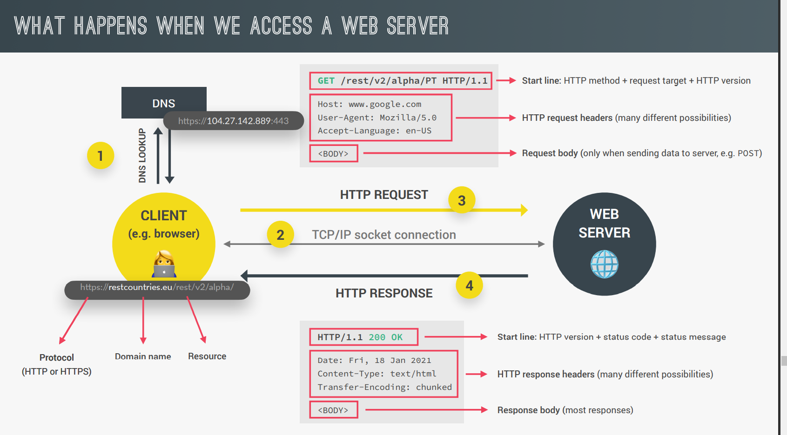

<link href="style.css" rel="stylesheet";>

<h1 style="text-align:center;"> ASYNC JS , AJAX, API's </h1>

<hr>
<hr>

<h2> Asynchronous JS - AJAX </h2>

<ul>

<li><b><span>AJAX</b></span> Asynch JavaScript And XML - we can use AJAX calls to request data from web servers dynamically </li>

</ul>

<h3 style="font-family:consolas;text-align:center;font-size:20px;"> XMLHttpRequest </h3>

</br>

<div style="border:2px solid white;padding:2rem;text-align:center;font-size:18px;color:skyblue;"><p>Solid Resource for Public API's - </p><p>https://github.com/public-apis/public-apis </p></div>
<ul>

<li><b><span>AJAX</b></span></li>
<li>XMLHttpRequest() is an old way of doing calls in JS - modern way is using Promises</li>

```
const request = new XMLHttpRequest();

request.open('GET','https://restcountries.eu/rest/v2/name/portugal');

request.send();

//The below console log will display the responseText once the data is fetched, even though we defined the callback below it

console.log(request.responseText);

// The send request is async, so we need to assign a callback to it

request.addEventListener('load',function() {
    const data = JSON.parse(this.responseText);
    console.log(data)
})


// The responseText property for request will be set once the call is complete - this refers to the request object

// The response will be in JSON form, so we need to parse it

JSON.parse(request.responseText);

```

<li>CORS should be Yes/No for API's to use</li>
<li>We can assign the <span>responseText</span> property to a variable and then construct an HTML element from it </li>

```
const request = new XMLHttpRequest();
request.open('GET','https://restcountries.eu/rest/v2/name/portgual');
request.send();

request.addEventListener('load',function(){
    const [data] = JSON.parse(this.responseText);

    console.log(data); // data will be a JSON object of all of the info about portugal with name, flag image, etc.

    // Creating an HTML element from the response data

    const html = `
    <article class="country">
        
        <div class="country_data">
            <h3 class="country_name">${data.name}</h3>
        </div>
        </article>
        `;
})
```

<li><b>How web requests work</b> </li>
<div>

</div>

</ul>

<div style="border:2px solid green;padding:2rem;">
<p>Example working code: Contents of Script.js</p>

```
const request = new XMLHttpRequest();
request.open("GET", "https://animechan.vercel.app/api/random");
request.send();
const elem = document.querySelector("div");

request.addEventListener("load", function () {
  const data = JSON.parse(this.responseText);

  console.log(data); // data will be a JSON object of all of the info about portugal with name, flag image, etc.

  // Creating an HTML element from the response data

  const html = `
    <article class="country">
        
        <div class="country_data">
            <h3 class="country_name">${data.name}</h3>
        </div>
        </article>
        `;
  elem.value = html;
});
```

</div>

</br>

<hr>

<h2> Promises 🔥 </h2>

</br>

<ul>

<li><span>Fetch</span> is the best way to use promises - ES6 feature that is beneficial to get rid of callback hell. Calling the fetch function immediately begins the promise. </li>

```
const request = fetch('https://animechan.vercel.app/api/random');

console.log(request);
```

<li> <b> Promise</b>  - A container for a future value </li>
<li>Promises can either be fulfilled or rejected.  </li>
<li>We can call the <span>.then()</span> method on all promises </li>
<li><span>.then()</span> accepts a callback function with 1 parameter which is the response </li>

```
const getCountryData = function (country) {
    fetch(`https://restcountries.eu/rest/v2/name/${country}`)
    .then(function(response) {
        console.log(response);
        return response.json(); // json is a method available on all response values that are resolved

        //response.json is also async, so we need to add another .then to it
    }).then(function(data) {
        console.log(data);
    })
    };

// Using arrow functions

const getCountryData = (country) => {
    fetch(`https://restcountries.eu/rest/v2/name/${country}`)).then(response=>response.json())
    .then(data=>console.log(data));
}

```

<li>The <a style="font-family:consolas;">return</a> block of the <span>.then()</span> callback defines the value of the response parameter to the next .then() callback </li>
Example:

```
fetch(`https://restcountries.eu/rest/v2/name/${country}`)
.then(response=>response.json())
.then(data=>{return 23;})
.then(responz=> alert(responz));

//The alert will display value of 23;

```

</ul>

<h2>Handling Rejected Promises </h2>

<ul>

<li>The fetch promise rejects when the user loses their internet connection </li>
<li> 2 ways to handle a rejection - </br> <b>1.</b> to pass in a second callback fn for promise rejection </li>

```
fetch(`https://restcountries.eu/rest/v2/name/${country}`)

.then(response => response.json() , err => alert(err));
```

<b>2</b> Using <span>.catch()</span> that will catch any errors that occured in all of the promises. This will catch any of the errors in the promises no matter where they happen in the chain of chained promises

```
fetch(`https://restcountries.eu/rest/v2/name/${country}`)
.then(response=>response.json())
.then(data=>{return 23;})
.then(responz=> alert(responz))
.catch(err=>alert(err));
```

<li> <span>.finally()</span> method - .then() is only called when promise is accepted, .catch() is called when promise is rejected, but finally() is called regardless </li>

</ul>

<h3 style="text-align:center;color:skyblue;font-size:20px;font-family:consolas;">Fixing 404 Errors <h3>

<ul>
<li> </li>

```
Suppose we throw a country that does exist to the API that will return a 404:

const getCountryData = function (country) {
    fetch(`https://restcountries.eu/rest/v2/name/${country}`)
    .then(response=>{
        console.log(response);

        // The response has an ok attribute that is set to false if the page cannot be found

        if (!response.ok) {
            throw new Error('Country not found');
        }

        return response.json
    })
    .catch(err=>alert(err));

}

```

</ul>

</br>

<h2> The Event Loop ➰ and Promises </h2>

</br>

```
console.log('Test Start');
setTimeout(()=>console.log('0 sec timer'), 0 );
Promise.resolve('Resolveed promise').then(res=>console.log(res));
console.log('Test End');

The code will execute in the following order-
Test Start
Test End
Resolved promise
0 sec timer

The promise callback gets added to the microtasks queue, and one callback in the callback queue. The microtasks queue will get executed first (promise message).
```

<ul>

<li>Creating a new promise- promise can either be resolved or rejected.</li>

```
const lotteryPromise = new Promise (function (resolve, reject) {

    if (Math.random() >= 0.5 ) {
        resolve('Winner');
    }

    else {
        reject('Loser');
        // this will appear in the catch block
    }
})

// Consuming the PROMISE

lotteryPromise.then(res=> console.log(res)).catch(err=>console.log(err));

// More direct way to resolve / reject promise

Promise.resolve('abc').then(res=>console.log(res));

Promise.reject('abc').then(err=>console.log(err));

```

<li> <b>Promisifying the Geolocation API </b></li>

</ul>

<h2> Async Await 🔥 </h2>

<ul>
<li>Introduced in 2017 - fastest way to resolve promises  </li>

```
const whereAmI =

async function(country) {

    const res = await fetch(`https://restcountries.eu/rest/v2/name/${country}`);

    // The await keyword stops code execution at this point until the promise is resolved (or the data is fetched in this case)

    console.log(res);
}

The above thing replaces the use of .then :

fetch(`https://restcountries.eu/rest/v2/name/${country}`).then(res=>console.log(res));

```

<li> Inside an async function, we can have one or more await statements - after await we put a promise</li>
<li>Promisifying the whereAmI function </li>

```
const whereAmI = async function (country) {
    const res = await fetch(`https://restcountries.eu/rest/v2/name/${country}`);

    const data = await res.json();

    console.log(data);


}

```

</ul>

</br>

<h3 style="text-align:center;color:skyblue;font-size:20px;font-family:consolas;">Error handling with try...catch <h3>

```
try {
    let y = 1;
    const x = 2;

    x = 3; // should give us an error
}

catch (err) {
    alert(err.message); // any error has the message property
}


```

<ul>
<li> The catch block has access to any errors from the try block by using the first parameter in a function - usually name it error </li>

</ul>

</br>

<h3 style="text-align:center;color:skyblue;font-size:20px;font-family:consolas;">Returning Values from Async functions <h3>

<ul>

<li>To return values from async functions, we can chain them to a .then method  </li>

```
If we have an async f'n:
const asyncSample = async function () {
    const res = await fetch(api);
    const data = await res.json();

    return data;
}

// Simply calling the async function will not return the value we want
asyncSample(); // will only return a promise

// Solution
asyncSample().then(returnMsg => console.log(returnMsg));
```

<li>  </li>
<li>  </li>

</ul>

</br>

<h3 style="text-align:center;color:skyblue;font-size:20px;font-family:consolas;">Running Promises in Parallel <h3>

<ul>
<li> Always wrap an async function around a try block </li>

```
const get3Countries = async function (c1, c2, c3) {
    try {
        const data1 = await getJSON(`https://restcountries.eu/rest/v2/name/${c1}`);
        const data2 = await getJSON(`https://restcountries.eu/rest/v2/name/${c2}`);
        const data3 = await getJSON(`https://restcountries.eu/rest/v2/name/${c3}`);
    }
    catch (err) {
        console.error(err);
    }
}
```

<li> <span>Promise.all()</span>- takes in an array of promises and returns a new promise - <b>using this method runs the promises in parallel </b> </br> <i>Note: if one promise rejects in Promise.all(), then all promises reject </i></li>

```
const get3Countries = async function (c1, c2, c3) {
    try {
        const data = Promise.all( [
            getJSON(`https://restcountries.eu/rest/v2/name/${c1}`),
            getJSON(`https://restcountries.eu/rest/v2/name/${c2}`),
            getJSON(`https://restcountries.eu/rest/v2/name/${c3}`),
        ]);
        console.log(data);
    }
    catch (err) {
        console.error(err);
    }
}

```

</ul>

</br>
<div style="border:2px solid skyblue;padding:2rem;">
<p style="text-align:center;color:skyblue;">Simple Promise Example : </p>

```
let p = new Promise ( (resolve, reject) =>
{
    let a = 1 + 1;
    if (a == 2) {
        resolve('Success');
    }
    else {
        reject('Failure');
    }
})

p.then((message)=>{
    console.log(message)
}).catch((message)=> {
    console.log(message)
});

// If a = 2, then the promise will resolve and the message will equal 'Success'
// If a !=2 , then the promise will reject and the catch statement will catch the rejection and the console.log(message) will return 'Failure'
```

</div>
</br>
<hr>

<h3 style="text-align:center;color:skyblue;font-size:20px;font-family:consolas;">Promise Combinators - race, allSettled, any <h3>

<ul>

<li>Promise.race() - whichever is the first promise to get fulfilled - (no matter resolved or rejected) is assigned as the resolved promise - we only get one result </li>

```
(async function () {
    const res = await Promise.race([
        getJSON(`https://restcountries.eu/rest/v2/name/italy`),
        getJSON(`https://restcountries.eu/rest/v2/name/mexico`),
        getJSON(`https://restcountries.eu/rest/v2/name/usa`),
    ])
})
```

</br>
<li>We can use the Promise.race() method to create a timeout function - we provide one fetch call and the second is a setTimeout function with a console.log('Req took too long') and a time of 2 seconds. If the original fetch call does not complete within 2 secs, the setTimeout function will get executed! </li>

```
First we can define the timeout function:

const timeOutFn = (seconds) => {
    return new Promise (_resolve, reject) // since we do not care about resolve we assign it to a throwaway var
    {
        setTimeout(function() {
            reject(new Error('Req took too long'));
        } , seconds )
    }
}

Promise.race([
    getJSON(`https://abc.com/v2/name`),
    timeoutFn(2)
]).then(res=>console.log(res));

```

</ul>

<h3 style="text-align:center;color:skyblue;font-size:16px;font-family:consolas;">Promise.allSettled() ES2020 <h3>

<ul>
<li> <span>Promise.allSettled()</span> - Takes in an array of promises and returns an array of the results of all promises- unlike Promise.all() , does not shortcircuit when one promise is rejected </li>

```
Promise.allSettled([
    Promise.resolve('Success'),
    Promise.reject('Failure'),
    Promise.resolve('Kappa'),
]).then(res=> console.log(res));

// Output will be an array of 3 objects
```

<li><span>Promise.any()</span> returns the first resolved promise and ignores rejected promises - similar to <span>Promise.race()</span> </li>
</ul>
